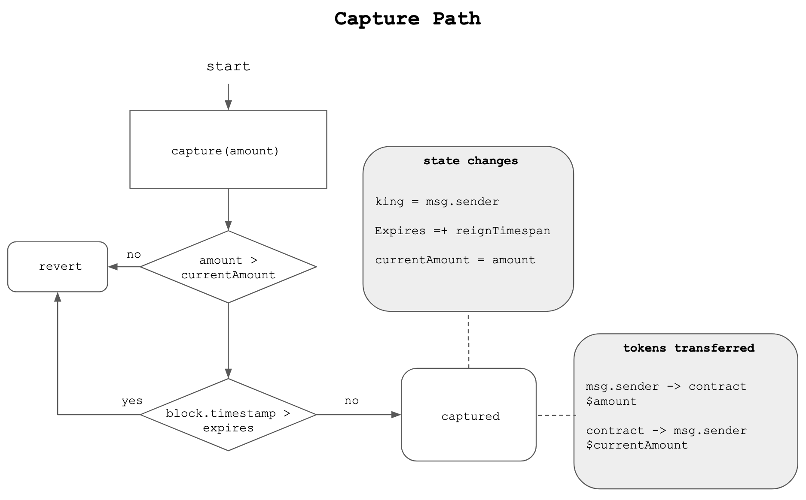
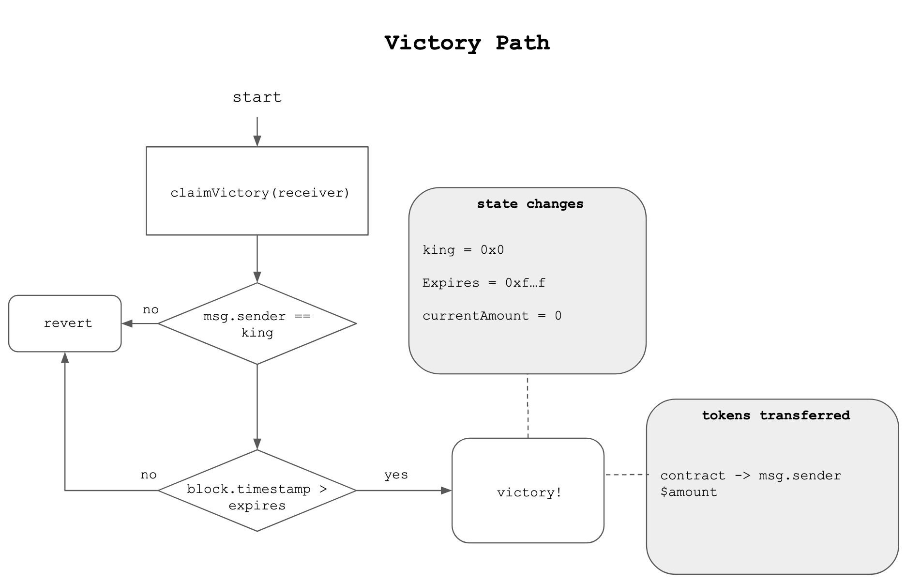

# king of the hill

Simple EVM smart contract 'game'. 

A player can deposit in the contract a larger amount of the target ERC20 than the previous, to claim the previous player's deposit (player becomes the king of the hill).

If the king isn't usurped for a defined amount of time, he can retrieve his locked tokens, and the game restarts.

## Functions (write)

### capture(uint256 amount)

Deposits `amount` ERC20 into the contract to attempt to claim the hill. Sender recieves the current deposit.

`revert`:

- `amount` isn't greater than the contract's current bounty.
- `msg.sender` doesn't have the specified amount.

### claimVictory()

Claims victory over the hill for `msg.sender`. Transfers the deposit back to `msg.sender` and resets the contract.

`revert`:

- `msg.sender` isn't currently the king.
- `block.timestamp` < `expiry` - the hill is still in play.

## Build + Test

Requies foundry. See https://github.com/foundry-rs/foundry.
